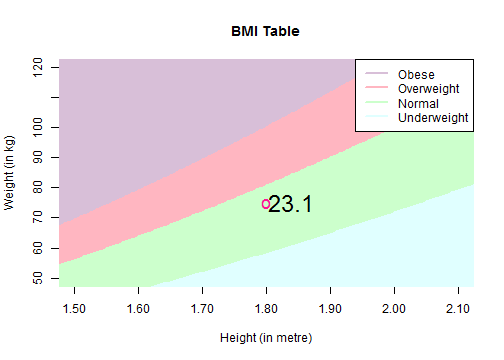

## What is BMI?

The BMI means Body Mass Index. It is a unit to categorize an indiviual by the measurements weight and height with the formula

$$BMI = \frac{kilogram}{meter^{2}}$$
    
A common classification is defined as:
<table>
<tr><th>BMI</th><th>category</th><tr>
<tr><td>&lt; 18.5</td><td>underweight</td></tr>
<tr><td>18.5 - 25.0</td><td>normal</td></tr>
<tr><td>25.0 - 30.0</td><td>overweight</td></tr>
<tr><td>&gt;30.0</td><td>obese</td></tr>
</table>
<br>There are also variations considering gender and age, and there are even countries with their own ranges.
In this app the common classification is used.
<br>For further details about BMI look here: https://en.wikipedia.org/wiki/Body_mass_index

---

## Imperial System (also known as British Imperial)

While BMI is calculated based on metric measurements, the imperial units are also widely spread around the world.<br>
To cope with it, this app have also the opportunity to calculate with imperial measurements. Therefore the imperial figures are converted to metric system by the factor 0.3048 for height and 0.45359237 for weight.<br>
So for example 5.9 feet and 165 pound are converted:

```r
x <- c(5.9, 165, 5.9*0.3048, 165*0.45359237, (165*0.45359237)/((5.9*0.3048)^2))
names(x) <- c("ft", "lb", "m", "kg", "BMI")
x
```

```
##        ft        lb         m        kg       BMI 
##   5.90000 165.00000   1.79832  74.84274  23.14279
```

For further details look here: https://en.wikipedia.org/wiki/Imperial_units

--- .class #id 

## Integration
The Sidebarpanel contains a radio button to differ between metric and imperial units. The two measurements for height and weight are doubled in two conditional subpanels recalculating in realtime and keep last inputs - even metric system changes.

The ranges for input won't cover any possibility, but I think for most it will be sufficient.

The desired BMI offers values within the normal BMI range between 18.5 and 25.

All changes are calculated in real time. The calculation is quick enough that there's no need for a reactive transaction.

---

## Example

The inputs are considered as 1.80 metres for height and 75 kilograms for weight. The calculated BMI is 23.1.

Test your BMI in the provided App! Give it a try!


